Installing and testing out linux mint distro.

Following a guide for installation at https://itsfoss.com/install-linux-mint-in-virtualbox/

Opening VirtualBox (I have some previously used VMs already)
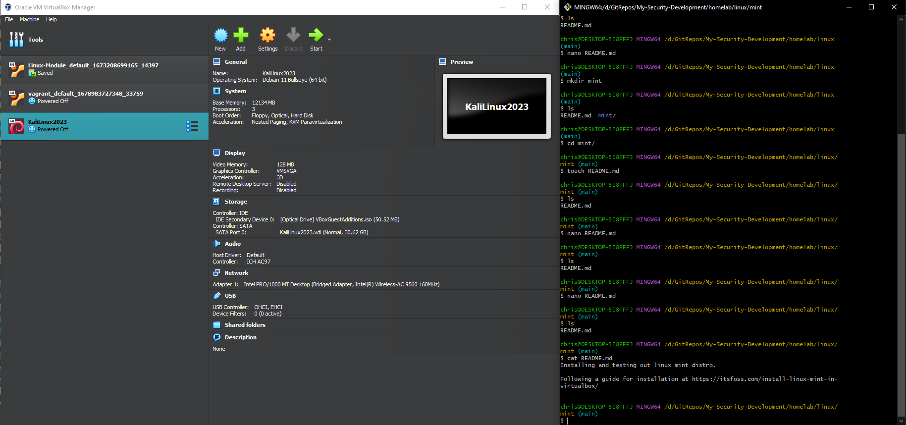

Specifying new VM's name, folder, type.
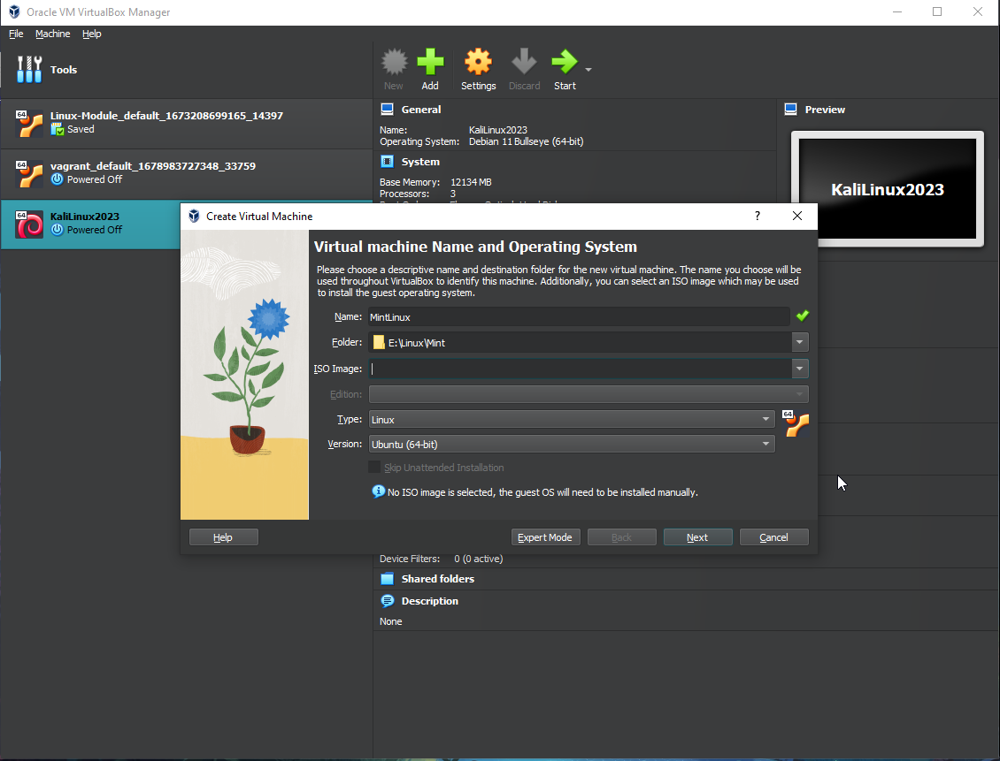

Specifying allocation of RAM and CPU count.
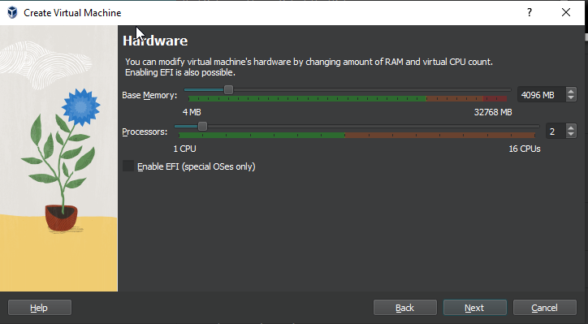

Creating virtual hard disk.
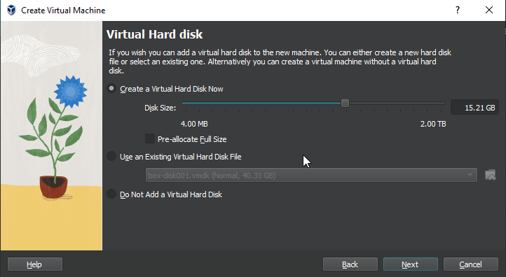

Summary and finish.
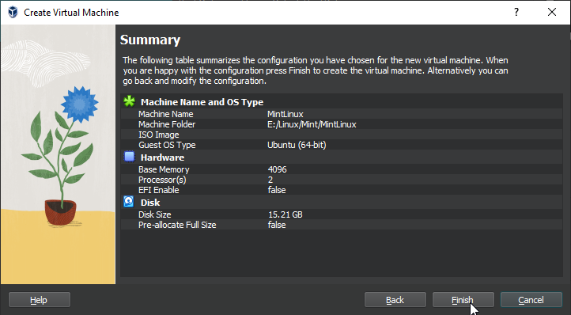

Download Linux Mint 21.3 Cinnamon Edition from https://www.linuxmint.com/edition.php?id=311
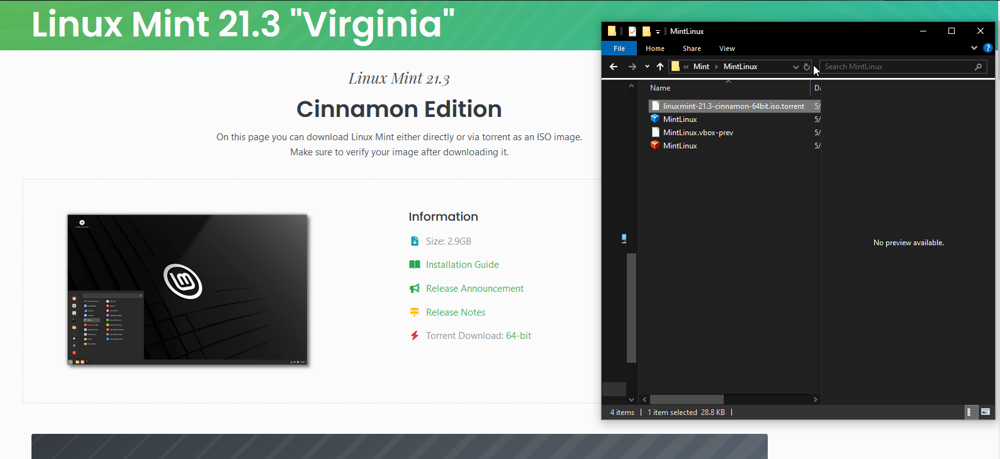

Save sha256 checksum to validate the iso file
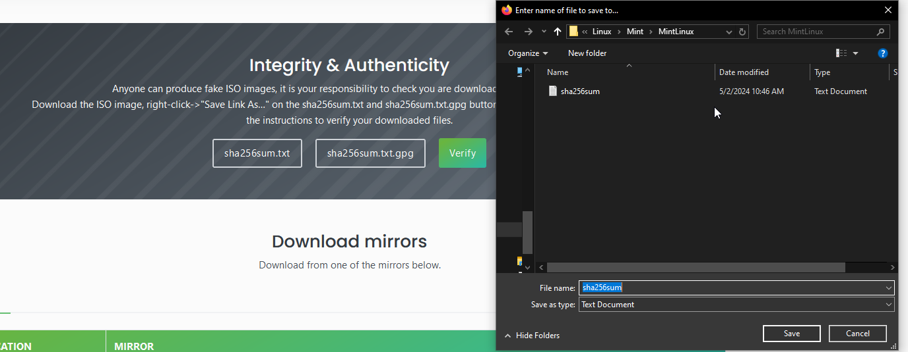

Iso is valid.
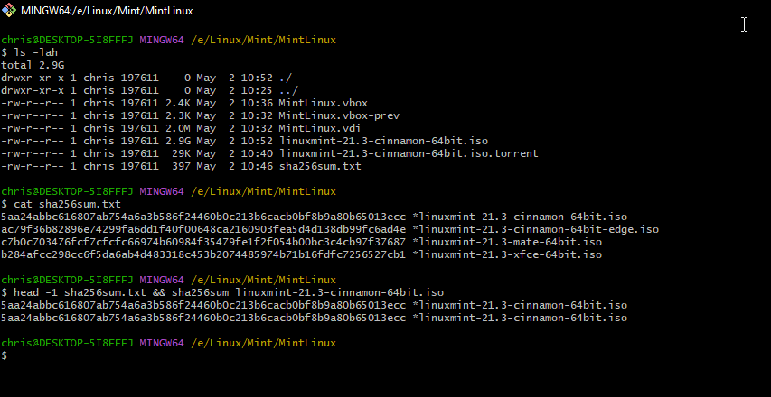

Selecting ISO for the VM.
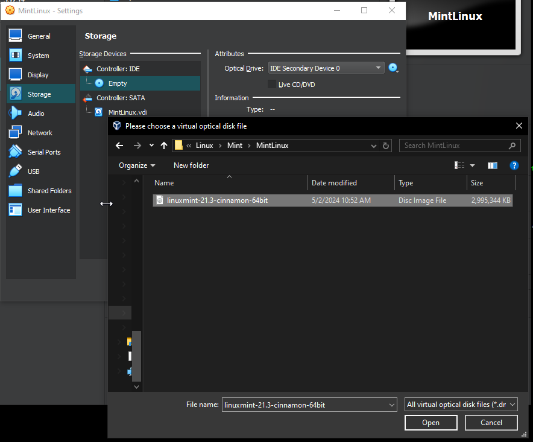

Starting the new Linux Mint 21.3 Cinnamon VM.
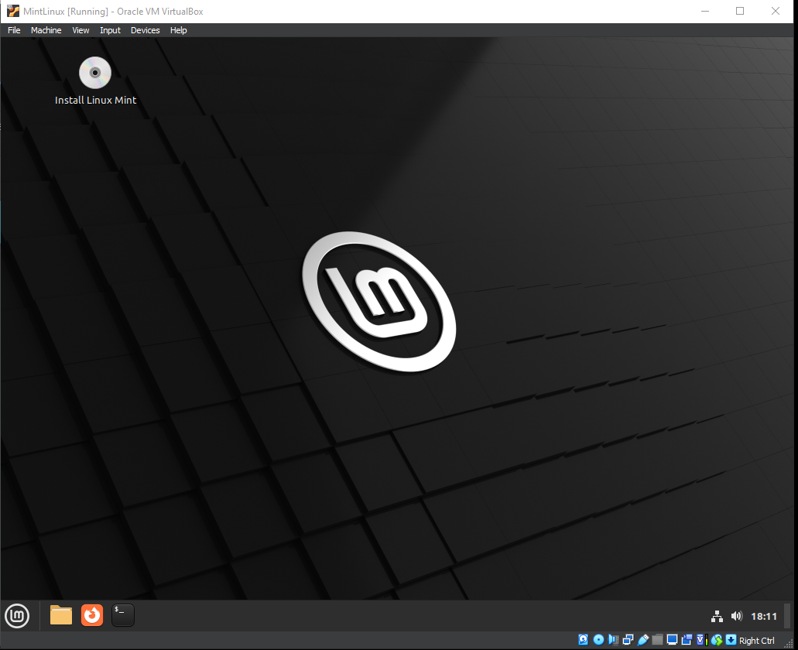

Apt update and apt upgrade.
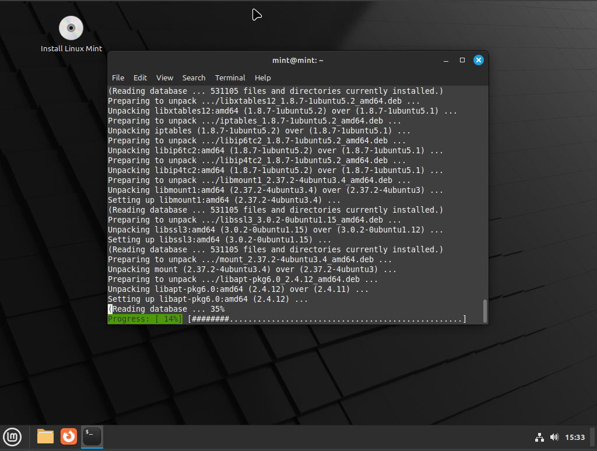

Reading Chapter 5 of LPI Linux Essentials Study Guide: Exan 010 V1.6 and testing out the different linux commands in a text only terminal from (ctrl+alt+F3).
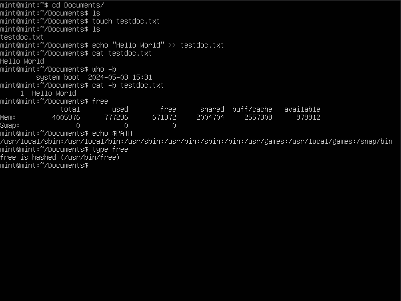

'whatis' and 'apropos' commands working after fix by running 'sudo mandb'.
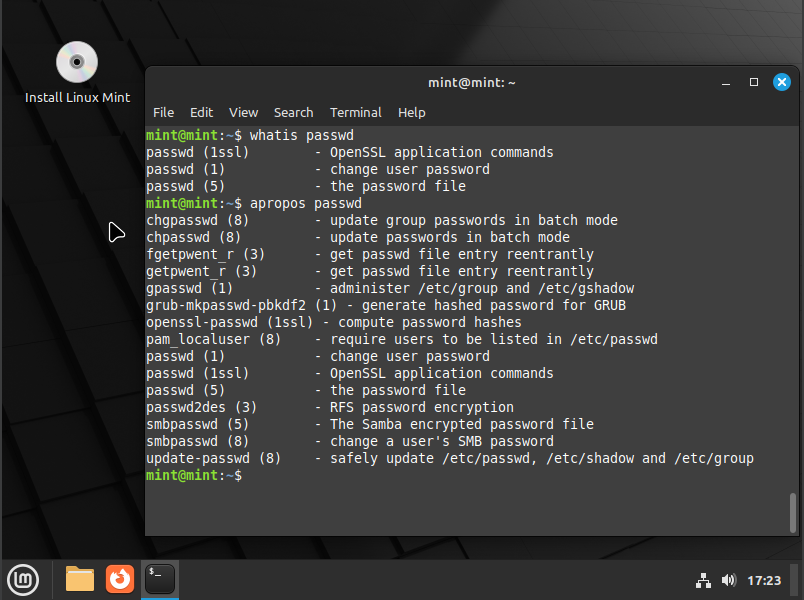

Messing with common 'less' command keystrokes (xg, xG, f, b, /pattern, ?pattern, etc).
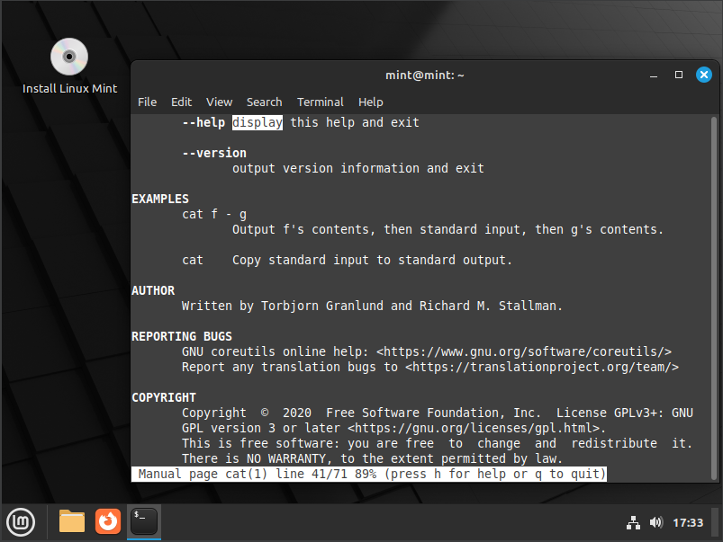

Becoming familiar with 'info' command and keystrokes (N, P, L, T, Enter, etc) for finding information on commands and navigating info/man pages.
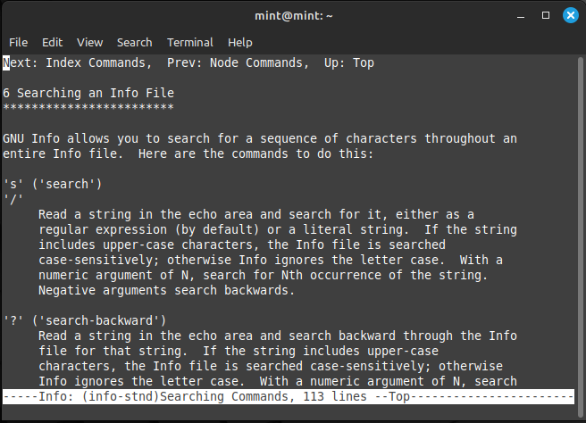

